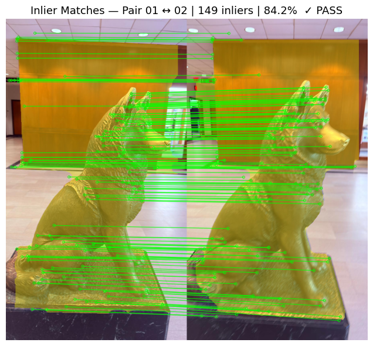
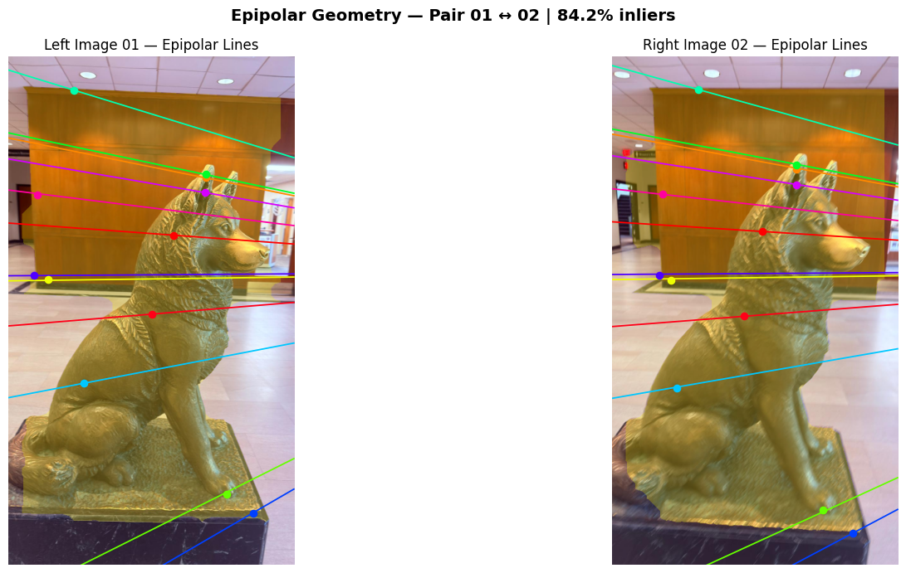

# 3D Scene Reconstruction via Structure-from-Motion (SfM)

A computer vision pipeline implementing **Stage 1 of Structure-from-Motion** — covering feature detection, descriptor matching, outlier rejection via RANSAC, and epipolar geometry validation — applied to a multi-view image dataset of a bronze dog statue captured at Northeastern University.

---

## Pipeline Overview

```
Multi-View Images → SIFT Detection → Lowe's Ratio Filtering → RANSAC (Fundamental Matrix) → Epipolar Geometry Validation
```

---

## Stage 1: Feature Extraction & Geometric Verification

### 1. SIFT Keypoint Detection
- Images downscaled by `0.5×` to reduce compute while preserving descriptor quality
- SIFT detects and computes descriptors across all 14 images
- Average **1199 keypoints per image**


---

### 2. Feature Matching — Lowe's Ratio Test
- BFMatcher with L2 norm used for nearest-neighbour matching
- Lowe's ratio threshold `t = 0.75` filters low-confidence matches
- Only matches where `d(m) < 0.75 × d(n)` are retained

---

### 3. Outlier Rejection — RANSAC
- Fundamental matrix `F` estimated via RANSAC
  - Reprojection threshold: `3.0 px`
  - Confidence: `99.9%`
- Inlier matches retained where reprojection error `< 3px`
- Target: **≥ 70% inlier ratio** per image pair



**Results across 13 consecutive pairs:**

| Pair | Raw Matches | Inliers | Inlier Ratio | Status |
|------|------------|---------|--------------|--------|
| 00 ↔ 01 | 2926 | 2382 | 81.4% | ✓ PASS |
| 01 ↔ 02 | 1538 | 1243 | 80.8% | ✓ PASS |
| 02 ↔ 03 | 387 | 235 | 60.7% | ✗ FAIL |
| 03 ↔ 04 | 1736 | 1377 | 79.3% | ✓ PASS |
| 04 ↔ 05 | 1258 | 905 | 71.9% | ✓ PASS |
| 05 ↔ 06 | 305 | 196 | 64.3% | ✗ FAIL |
| 06 ↔ 07 | 578 | 378 | 65.4% | ✗ FAIL |
| 07 ↔ 08 | 285 | 79 | 27.7% | ✗ FAIL |
| 08 ↔ 09 | 107 | 37 | 34.6% | ✗ FAIL |
| 09 ↔ 10 | 1238 | 898 | 72.5% | ✓ PASS |
| 10 ↔ 11 | 268 | 135 | 50.4% | ✗ FAIL |
| 11 ↔ 12 | 142 | 10 | 7.0% | ✗ FAIL |
| 12 ↔ 13 | 662 | 406 | 61.3% | ✗ FAIL |

**8 of 13 pairs passed** the ≥70% inlier threshold.

---

### 4. Epipolar Geometry Validation
- Epilines computed via `cv2.computeCorrespondEpilines`
- 12 sampled point-line pairs visualized per image pair
- Epilines from left image project onto corresponding points in right image, confirming geometric consistency of estimated `F`


---

## Dataset
- **Subject**: Bronze Husky statue, Northeastern University
- **Images**: 14 multi-view photographs captured by handheld smartphone
- **Capture pattern**: Consecutive views with ~30° rotation increments around the subject
- **Failing pairs** (07↔08, 08↔09, 11↔12) attributed to large viewpoint jumps between captures

---

## Tech Stack

| Component | Tool |
|-----------|------|
| Feature Detection | SIFT (`cv2.SIFT_create`) |
| Matching | BFMatcher + Lowe's Ratio Test |
| Outlier Rejection | RANSAC (`cv2.findFundamentalMat`) |
| Epipolar Validation | `cv2.computeCorrespondEpilines` |
| Environment | Python, OpenCV, NumPy, Matplotlib, Google Colab |

---

## Repository Structure

```
├── main.ipynb          # Full Stage 1 pipeline notebook
├── project2/           # Input image dataset (Google Drive)
└── README.md
```

---

## Planned: Stage 2
- Camera pose estimation from Essential Matrix
- Triangulation of 3D point cloud
- Bundle adjustment for global refinement
- Dense reconstruction

---

## Authors
Priyanka Lakariya — Northeastern University MS Robotics
```
